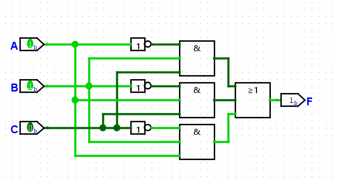

##### _Written in Markdown by Onni Kivinen_ - https://github.com/onnikiv/Hardware1_Digital-Circuits
# Digital Circuits - 3 Boolean Algebra
Third week's assignments


### 1.1 De Morgan's theorem

$\overline{\overline{A}+B}=\overline{\overline{A}}\cdot\overline{B}=A\cdot\overline{B}$

$\overline{A \cdot \overline B \cdot \overline C} \rightarrow \overline A + \overline{\overline B} + \overline{\overline C} = \overline A + B + C$

$\overline{(\overline A + B) \cdot (A + \overline B)} \rightarrow (\overline{\overline A} \cdot \overline B) + (\overline A \cdot \overline{\overline B}) = (A \cdot \overline B) + (\overline A \cdot B)$

___

### 1.2 Canonical SOP and POS

Truth table
| Row | A | B | F |       |
|:---:|:-:|--:|--:|------:|
|__0__| 0 | 0 | 1 | ← SOP |
|__1__| 0 | 1 | 0 | ← POS |
|__2__| 1 | 0 | 1 | ← SOP |
|__3__| 1 | 1 | 0 | ← POS |

In the Sum of Products (SOP) we need to find where the function F has a value 1.

$F(A,B) = \overline A \cdot \overline B + A \cdot \overline B$

$F(A,B) = m0 + m2$

$F(A,B) = \Sigma m(0,2)$

In the Product of Sums (POS) we need to find where function F has a value 0.

$F(A,B) = (A + \overline B) \cdot (\overline A + \overline B)$

$F(A,B) = M1 \cdot M3$

$F(A,B) = \Pi M(1,3)$

___

### 1.3 Truth table from a standard expression

Truth table for F:

$F(A,B) = A \overline B + B$

| A | B | F | Calculation  |
|:--|---|--:|:-------------|
| 0 | 0 | 0 | ← $F(0,0) = 0 \cdot \overline 0 + 0 = 0 \cdot 1 + 0 = 0$ |
| 0 | 1 | 1 | ← $F(0,1) = 0 \cdot \overline 1 + 1 = 0 \cdot 0 + 1 = 1$ |
| 1 | 0 | 1 | ← $F(1,0) = 1 \cdot \overline 1 + 1 = 1 \cdot 0 + 1 = 1$ |
| 1 | 1 | 1 | ← $F(1,1) = 1 \cdot \overline 0 + 1 = 1 \cdot 1 + 1 = 1$ |

Truth table for G:

$G(A,B) = (A+B) \cdot (\overline A + \overline B)$

| A | B | G | Calculation  |
|:--|---|--:|:--|
| 0 | 0 | 0 | ← $G(0,0) = (0+0) \cdot (\overline 0 + \overline 0) = 0 \cdot (1+1) = 0$ |
| 0 | 1 | 1 | ← $G(0,1) = (0+1) \cdot (\overline 0 + \overline 1) = 1 \cdot (1+0) = 1$ |
| 1 | 0 | 1 | ← $G(1,0) = (1+0) \cdot (\overline 1 + \overline 0) = 1 \cdot (0+1) = 1$ |
| 1 | 1 | 0 | ← $G(1,1) = (1+1) \cdot (\overline 1 + \overline 1) = 1 \cdot (0+0) = 0$ |

___

### 1.4 De Morgan’s theorem in programming
Jamie's code:

```python
if not (not L or not C or not R): 
    full_speed()
```


$(\overline{\overline{L} + \overline{C} + \overline{R}}) = \overline{\overline L}\cdot \overline{\overline C} \cdot \overline{\overline R} = L + C + R$

If the robot is __on__ the charger, the sensors' values are __1__:

$L \cdot C \cdot R = 1 \cdot 1 \cdot 1 = 1$

This returns __True__, and the robot should now run the function __full_speed()__.

If the robot is __not on__ the charger, the sensors' values are __0__:

$L \cdot C \cdot R = 0 \cdot 0 \cdot 0 = 0$

this returns __False__, which doesn't run the wanted function.

Therefore, Jamie's if-statement is __incorrect__.

___

### 1.5 Canonical forms

Function for Jamie's charging station:

If all the 3 sensors return a __True__, the robot is in the correct position.

Jamie noticed that if exactly two sensors are on the station, rotating the robot will bring it into correct alignment, making all three sensors return True.

|  A  |  B  |  C  | Move robot (F) |
|:---:|:---:|:---:|:--------------:|
|  0  |  0  |  0  |     0          |
|  0  |  0  |  1  |     0          |
|  0  |  1  |  0  |     0          |
|  0  |  1  |  1  |     1          |
|  1  |  0  |  0  |     0          |
|  1  |  0  |  1  |     1          |
|  1  |  1  |  0  |     1          |
|  1  |  1  |  1  |     0          |


#### Canonical SOP of the function:

$F(A, B, C) = \overline{A} B C + A \overline{B} C + A B \overline{C}$



___

### 1.6 Draw circuit diagram and simulate 

With the values: A = 0, B = 1 and C = 1

$F = \overline A \cdot B + B \cdot \overline C$


$G = (A + B) \cdot (\overline B + \overline C)$


___