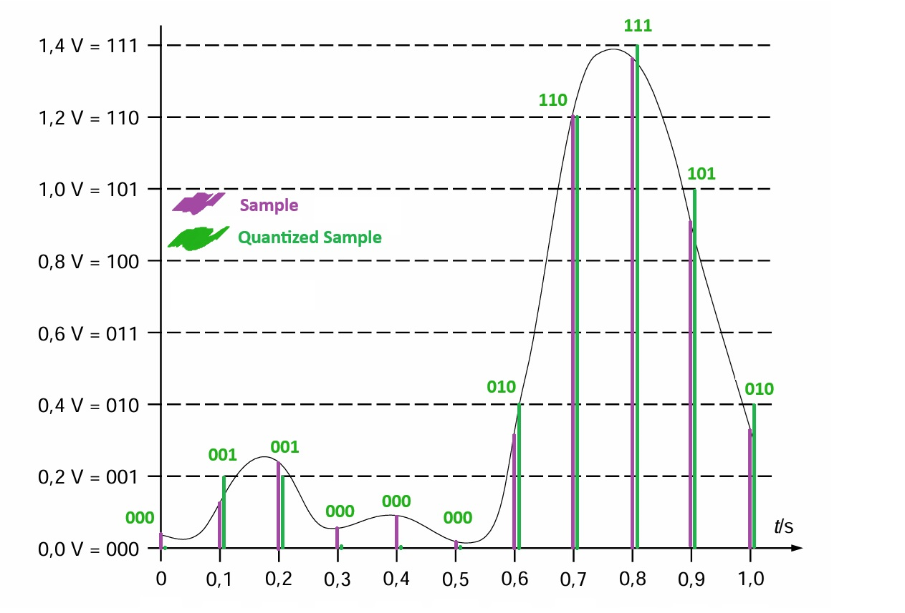

##### _Written in Markdown by Onni Kivinen_ - https://github.com/onnikiv/Hardware1_Digital-Circuits
# Digital Circuits - 1 AD-conversion
First week's assignments

### 1.1 A/D-conversion, linear quantization 

___
### 2.1 AD-conversion
Mathematical formula:

$$
\text{Voltage} = \text{ADC value} \times \frac{\text{Reference voltage}}{2^{\text{ADC bit count}} - 1}
$$

* __12-bit__ linear AD-converter 
* reference voltage: __3.3 V__
___
#### 1. - _ADC value: 2734_
$$
\text{V} = \text{2734} \times \frac{\text{3.3 (V)}}{2^{\text{12}} - 1} ≈ {\space{\space{\underline{2.2\space{V}}}}}
$$
#### 2. - _ADC value: 3999_
$$
\text{V} = \text{3999} \times \frac{\text{3.3 (V)}}{2^{\text{12}} - 1} ≈ {\space{\space{\underline{3.2\space{V}}}}}
$$
#### 3. - _ADC value: 137_
$$
\text{V} = \text{137} \times \frac{\text{3.3 (V)}}{2^{\text{12}} - 1} ≈ {\space{\space{\underline{0.1\space{V}}}}}
$$
#### 4. - _ADC value: 512_
$$
\text{V} = \text{512} \times \frac{\text{3.3 (V)}}{2^{\text{12}} - 1} ≈ {\space{\space{\underline{0.42\space{V}}}}}
$$
___
### 2.2 AD-conversion
Mathematical formula:

$$
\text{Voltage} = \text{ADC value} \times \frac{\text{Reference voltage}}{2^{\text{ADC bit count}} - 1}
$$

Conversion of the formula:

$$
\text{Voltage} \times (2^{\text{ADC bit count}} - 1) = \text{ADC value} \times \text{Reference voltage}
$$

$$
\text{ADC value} = \frac{\text{Voltage} \times (2^{\text{ADC bit count}} - 1)}{\text{Reference voltage}}
$$

* __14-bit__ linear AD-converter 
* reference voltage: __5.0 V__
___
#### 1. - _input voltage: 3.3 V_
$$
\text{ADC value} = \frac{\text{3.3} \times (2^{\text{14}} - 1)}{\text{5.0}} ≈ {\space{\space{\underline{10812}}}}
$$
#### 2. - _input voltage: 0.65 V_
$$
\text{ADC value} = \frac{\text{0.65} \times (2^{\text{14}} - 1)}{\text{5.0}} ≈ {\space{\space{\underline{2129}}}}
$$
#### 3. - _input voltage: 5.0 V_
$$
\text{ADC value} = \frac{\text{5.0} \times (2^{\text{14}} - 1)}{\text{5.0}} ≈ {\space{\space{\underline{16383}}}}
$$
#### 4. - _input voltage: 2.1 V_
$$
\text{ADC value} = \frac{\text{2.1} \times (2^{\text{14}} - 1)}{\text{5.0}} ≈ {\space{\space{\underline{6880}}}}
$$
___
### 3. AD-converion in RPi Pico
#### 3.1 Python code where the blinking of the LED is determined by the ADC value reading. 

```python
from machine import ADC, Pin
import time

adc = ADC(Pin(26))		# ADC object to ADC pin 26
adc.read_u16()			# ADC value: 0-65535 across voltage range 0.0v - 3.3v
led = Pin("LED", Pin.OUT)

while True:
    print(str(adc.read_u16())) # debug
    blink_time = int(adc.read_u16()/100) # speed of the blinking
    # division by 100 so the blinking is much faster
    led.on()
    time.sleep_ms(blink_time)
    led.off()
    time.sleep_ms(blink_time)
```
#### 3.2 Answers:
If you turn the trimmer all the way to the left, it provides the maximum ADC values, resulting in a slow blinking rate. Conversely, when the trimmer is turned all the way to the right, the ADC readings are low, causing the LED to blink quickly.