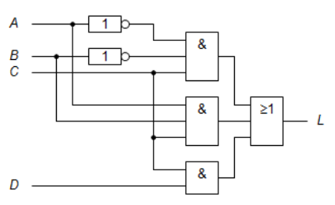
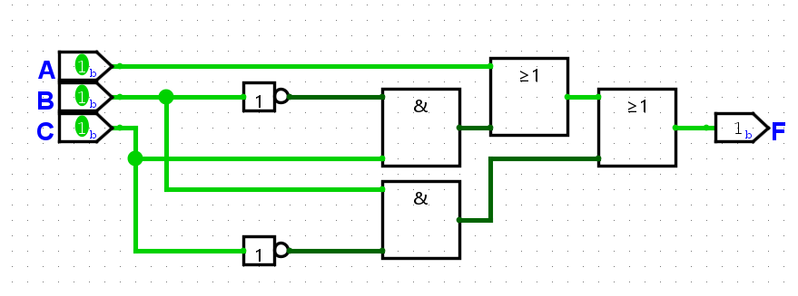
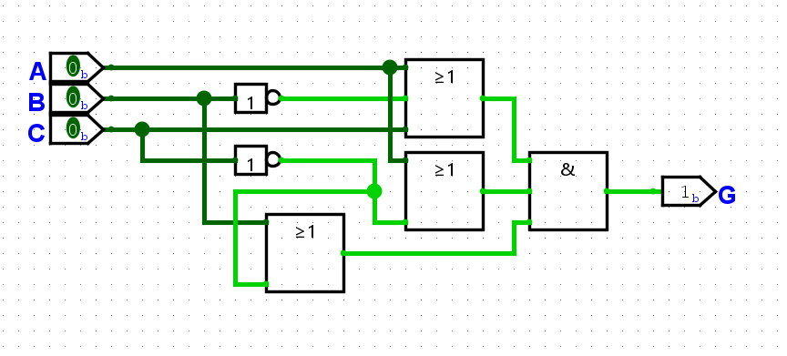

##### _Written in Markdown by Onni Kivinen_ - https://github.com/onnikiv/Hardware1_Digital-Circuits
# Digital Circuits - 2 Expressions and truth table
Second week's assignments

### 1.1 Truth table
| A | B | F |
|:--|---|--:|
| 0 | 0 | 1 |
| 1 | 0 | 0 |
| 0 | 1 | 0 |
| 1 | 1 | 1 |

| A | B | G |
|:--|---|--:|
| 0 | 0 | 1 |
| 1 | 0 | 0 |
| 0 | 1 | 0 |
| 1 | 1 | 0 |

___
### 1.2 Truth table and expression from verbal description

| Button 1 | Button 2 | Alarm | Vault door |
|:--------:|:--------:|:-----:|:----------:|
|    1     |    0     |   0   |     0      |
|    1     |    1     |   0   |     1      |
|    1     |    1     |   1   |     0      |
|    1     |    0     |   1   |     0      |
|    0     |    1     |   0   |     0      |
|    0     |    1     |   1   |     0      |
|    0     |    0     |   1   |     0      |
|    0     |    0     |   0   |     0      |
___
### 1.3 Evaluate expression

>#### Basic logical operations:
>| Operation | Symbol |
>|:---------:|:------:|
>|$$AND$$   |$$\cdot$$|
>|$$OR$$    |$$+$$  |
>|$$NOT$$   |$$\overline{A}$$|

Functions F and G:

$$F = \overline{A}\cdot{C}+B\cdot\overline{C}$$

$$G = (A + B) \cdot (\overline{B} + \overline{C})$$

Values of both functions when:

**A = 0**

**B = 1**

**C = 1**

|Function F                                       |
|:------------------------------------------------|
|$$F = \overline{A}\cdot{C}+B\cdot\overline{C}$$  |                              
|$$F = \overline{0} \cdot{1}+1 \cdot\overline{1}$$|
|$$F = 1 \cdot{1}+1 \cdot{0}$$                    |
|$$F = 1 +1 \cdot{0}$$                            |
|$$F = 1 + 0 $$                                   |
|$$F = 1$$                                        |

|Function G                                         |
|:--------------------------------------------------|
|$$G = (A + B) \cdot (\overline{B} + \overline{C})$$|                              
|$$G =(0+1) \cdot {(\overline{1} + \overline{1})} $$|
|$$G =(0+1) \cdot {({0} + {0})} $$                  |
|$$G = 1 \cdot 0$$                                  |
|$$G = 0$$                                          |
___
### 1.4 Expression from circuit diagram
Construct an expression defining function L(A, B, C, D) represented in the following circuit
diagram:

*(beautiful sketch of the circuit, done with paint)*

Expression starting from the function (L). -> Right to Left.

- 3 inputs to the OR gate:

$$ L = (\space) + (\space) + (\space)$$

Starting from the top: 
 - 3 inputs to the top AND gate:
 - 3 inputs to the middle AND gate:
 - 2 inputs to the bottom AND gate:

$$ L = (X\cdot X\cdot X) + (X \cdot X \cdot X) + (X \cdot X)$$

2 NOT gates at the top:

$$ L = (\overline{X} \cdot \overline{X} \cdot X) + (X \cdot X \cdot X) + (X \cdot X)$$

Now inserting the correct variables to the function:

$$ L(A,B,C,D)= (\overline{A} \cdot \overline{B} \cdot C) + (A \cdot B \cdot C) + (C \cdot D)$$

___
### 1.5 Draw circuit diagram

$$
F = A + \overline{B} \cdot C + B \cdot \overline{C}
$$

$$
G = ( A + \overline{B} + C )( A + \overline C )( B + \overline{C} )
$$

___

### 1.6 Design combinatinal circuit

>___
> ### Extra mapping
>|                | Active | Inactive | Name  |  Type    |
>|:---------------|:------:|:--------:|------:|:--------:|
>|Button_Door     |    1   |     0    | $$A$$ | Variable |
>|Speedometer     |    1   |     0    | $$B$$ | Variable |
>|Button_inspector|    1   |     0    | $$C$$ | Variable |
>|Door_Open       |    1   |     0    | $$G$$ | Function |
>___

### Truth Table for a single door
- 2 doors on the bus, but both doors have the same truth table. Thus the truth table for a single door.

| Button_Door (A) | Speedometer (B) | Button_inspector (C) | Door_Open (G) |
|:---------------:|:---------------:|:--------------------:|:-------------:|
|        0        |        0        |           0          |       0       |
|        1        |        0        |           0          |       1       |
|        1        |        1        |           0          |       0       |
|        1        |        1        |           1          |       0       |
|        1        |        0        |           1          |       0       |
|        0        |        1        |           0          |       0       |
|        0        |        1        |           1          |       0       |
|        0        |        0        |           1          |       0       |

