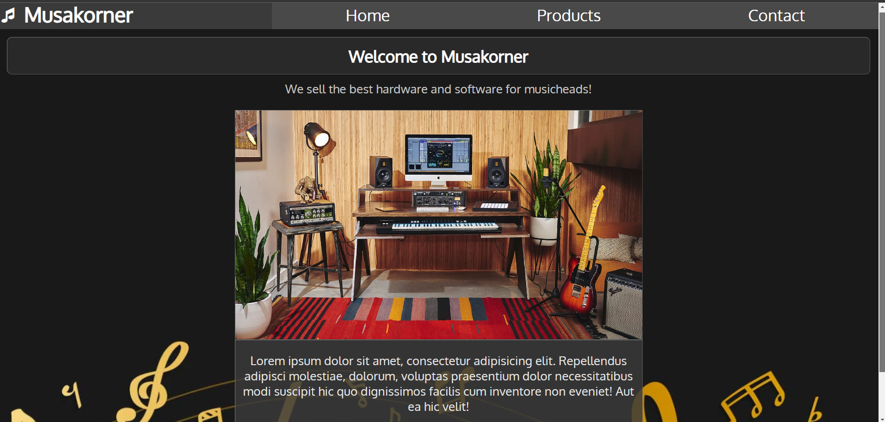

## Sisältö
### HTML + CSS (Ohjelmisto 2):

* Tämä repository sisältää Metropolian tieto- ja viestintätekniikan insinööriohjelman ensimmäisen vuoden Ohjelmisto 2 -kurssilla luodun henkilökohtaisen verkkosivun.
- Web-kehityksen perusteet arvosana 5.
#

(kuva etusivusta)
# 